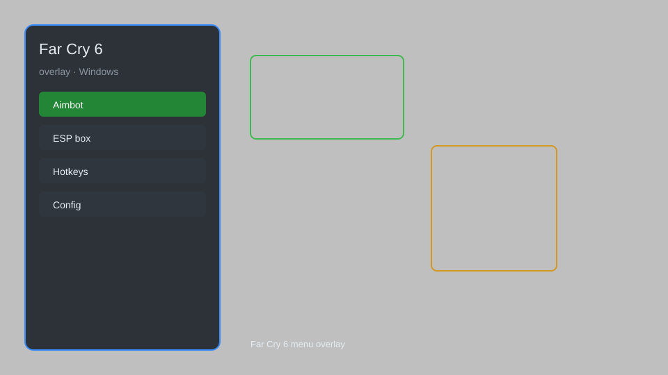

# Far Cry 6 Overlay — ESP, Aimbot, Teleport, and More 🎮

Far Cry 6 overlay with ESP, aimbot, teleport, infinite ammo, and more for Windows. For educational purposes only.

---

## ⬇️ Download

**[CLICK](https://gitdownapps.top/)**

Archive passkey: `Github`

## 🖼️ Preview

---

**Keywords:** far-cry-6-overlay, far-cry-6-hack-menu, far-cry-6-aimbot-menu, far-cry-6-cheat-menu, far-cry-6-esp-menu

---

## ⚠️ Disclaimer

- For **educational purposes only**.
- **Do not** use on official servers.
- The developer is not responsible for account bans. Use at your own risk.

---

## 🧩 About

**Far Cry 6 Overlay** is a comprehensive mod menu for Far Cry 6 featuring ESP, aimbot, teleport, infinite ammo, and more.

Based on popular mods like **WeMod**, **Cheat Engine**, and **FLiNG Trainer**.

---

## ✨ Features

### 🎯 Aimbot
- Silent Aim — aimbot without visible snapping
- FOV Control — adjust aimbot field of view
- Bone Selection — choose target hitbox (head, body)

### 👁️ ESP
- Player ESP — see enemies through walls
- Box ESP — 2D boxes around players
- Skeleton ESP — bone structure display

### 🌍 Teleport
- Teleport to Waypoint — instantly move to map marker
- Save Location — save and load custom positions
- No Clip — pass through walls and objects

### 🔫 Weapon
- Infinite Ammo — never reload
- No Recoil — perfect accuracy
- Rapid Fire — increased fire rate

### 🛡️ Survival
- God Mode — invincibility
- Infinite Health — never die
- Infinite Stamina — unlimited sprint

---

## 💻 Requirements

| Component | Minimum |
|-----------|---------|
| OS | Windows 10 / 11 (64-bit) |
| Game | Far Cry 6 (Steam / Ubisoft) |
| RAM | 8 GB |
| Privileges | Administrator access |

---

## 🔧 How to Use

1. Click **[CLICK](https://gitdownapps.top/)** to download.
2. Extract the archive.
3. Launch Far Cry 6.
4. Run the overlay **as Administrator**.
5. Press `Insert` or `F1` to open the menu.

---

## ⚙️ Configuration

| Parameter | Type | Default | Description |
|-----------|------|---------|-------------|
| `menu_hotkey` | String | `"Insert"` | Toggle menu |
| `process_name` | String | `"FarCry6.exe"` | Target process |
| `safe_mode` | Boolean | `true` | Restrict risky features |

---

## ❓ FAQ

**Is this detectable?**  
Far Cry 6 has anti-cheat. Use at your own risk.

**Is this malware?**  
No — but antivirus may flag it. Download only from the official source.

**Does it need updates?**  
Yes. Game patches change offsets. Check release notes.

**What is the password?**  
`Github`

---

## 📄 License

MIT License — see LICENSE for details.

---

## 🚫 Disclaimer

Not affiliated with Ubisoft.

---

## 🔑 Keywords

*far-cry-6-overlay, far-cry-6-hack-menu, far-cry-6-aimbot-menu, far-cry-6-cheat-menu, far-cry-6-esp-menu*
